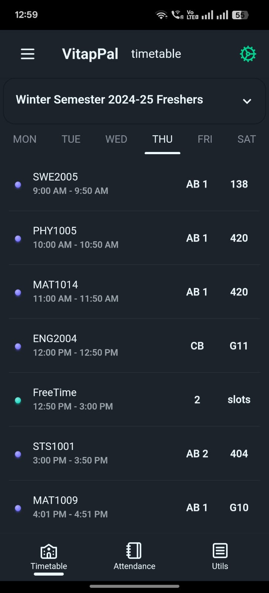
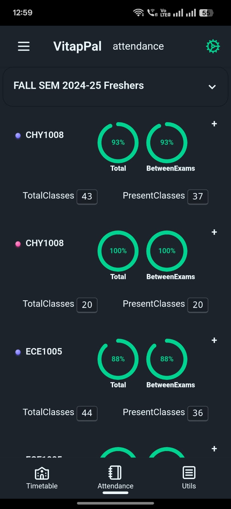
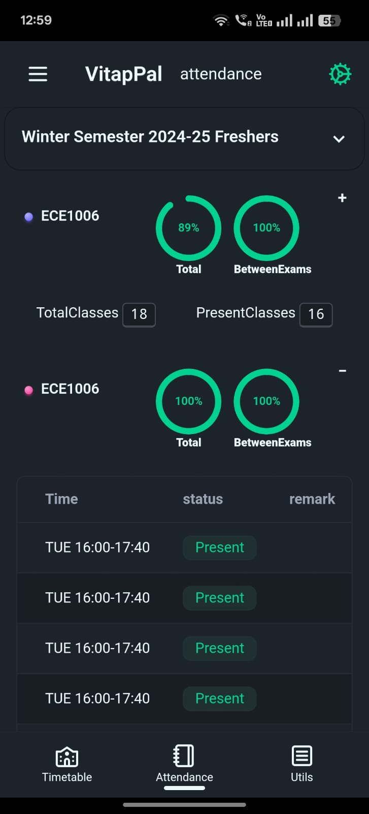

# Vitap Pal

An app designed to enhance the convenience of VIT-AP student life.

Eliminate the hassle of repeatedly entering credentials. Simply log in once, and the app will maintain up-to-date timetables and attendance records. Offline viewing is also supported.

Access your timetable and attendance information anytime, even without an internet connection.

  
  
  

## Contributions are Welcome

Feel free to contribute if you're interested.

This project utilizes Tauri (src-tauri) and SvelteKit (src).

## Recommended IDE Setup

[VS Code](https://code.visualstudio.com/) + [Svelte](https://marketplace.visualstudio.com/items?itemName=svelte.svelte-vscode) + [Tauri](https://marketplace.visualstudio.com/items?itemName=tauri-apps.tauri-vscode) + [rust-analyzer](https://marketplace.visualstudio.com/items?itemName=rust-lang.rust-analyzer).
